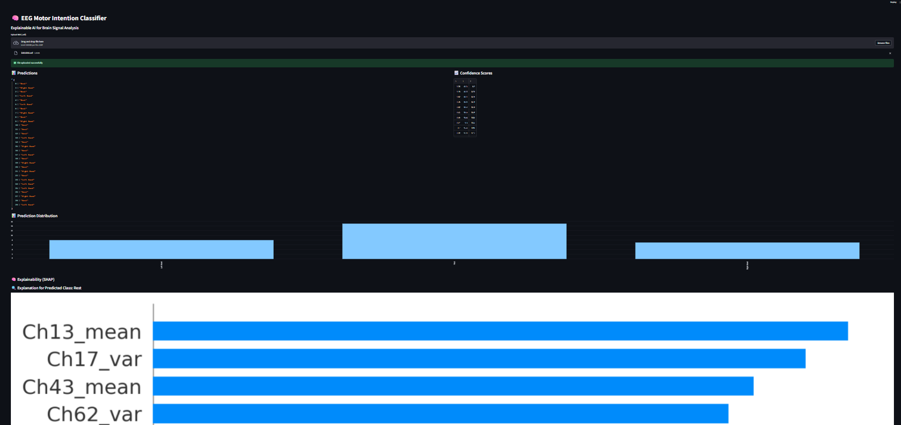
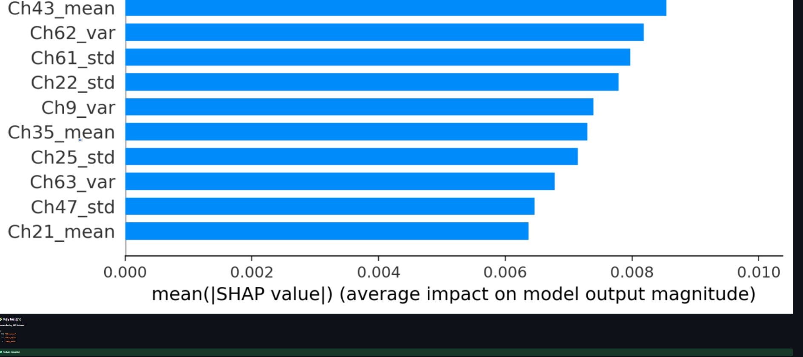
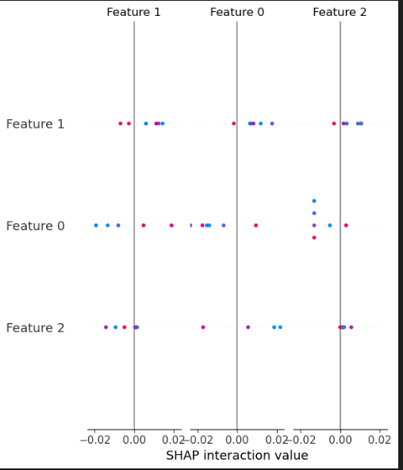

# 🧠 EEG Motor Intention Classifier

An Explainable AI (XAI) application for Brain Signal Analysis built with Streamlit, MNE-Python, and SHAP.

This project classifies EEG signals (specifically from `.edf` files) into different motor intentions (Rest, Left Hand, Right Hand) and provides transparent, interpretable results using SHAP (SHapley Additive exPlanations).

## 🚀 Features

- **EEG Processing Pipeline**: Automatically loads, filters (1Hz-40Hz), and epochs EEG data using [MNE-Python](https://mne.tools/).
- **Feature Extraction**: Extracts statistical features (Mean, Variance, Standard Deviation) across 64 EEG channels.
- **Machine Learning Classification**: Uses a pre-trained model to predict motor intentions (Rest, Left Hand, Right Hand).
- **Explainable AI (XAI)**: Integrates `SHAP` to explain individual predictions, showing exactly which brain regions/channels influenced the model's decision.
- **Interactive UI**: Built with Streamlit for a seamless, user-friendly data upload and analysis experience.

## 📸 Screenshots

### Web UI


### Predictions & Explanations



## 🛠️ Installation

1. **Clone the repository**:
   ```bash
   git clone https://github.com/your-username/eeg-intention-classifier.git
   cd eeg-intention-classifier
   ```

2. **Install necessary dependencies**:
   Ensure you have Python 3.8+ installed. Run the following command:
   ```bash
   pip install streamlit numpy mne joblib shap matplotlib
   ```

## 💻 Usage

1. Start the Streamlit application:
   ```bash
   streamlit run APP.py
   ```
2. Open your web browser and navigate to the local URL provided by Streamlit (usually `http://localhost:8501`).
3. Upload an EEG file (`.edf` format) to see the processing, prediction, and SHAP explainability in real-time. A sample data file (`S001R03.edf`) is provided.

## 📂 Project Structure

- `APP.py`: The main Streamlit web application.
- `CODE.ipynb`: Jupyter notebook for data exploration, feature extraction research, and model development.
- `eeg_model.pkl`: The pre-trained machine learning model.
- `S001R03.edf`: Sample EEG data file for testing.

## 🧠 How It Works under the hood

1. **Preprocessing**: The raw EDF file is read and a band-pass filter of `1.0 - 40.0 Hz` is applied. 
2. **Epoching**: Extracts events from the EEG annotations and splits the data into 2-second windows (epochs).
3. **Feature Engineering**: Computes the mean, variance, and standard deviation for each of the 64 channels, creating an array of 192 features per epoch.
4. **Prediction**: The model (`eeg_model.pkl`) predicts the motor intention class and outputs confidence scores.
5. **Interpretation**: SHAP computes feature importance on the fly and generates a bar plot of top contributing features for the predicted class.

## 📄 License
This project is licensed under the MIT License.
